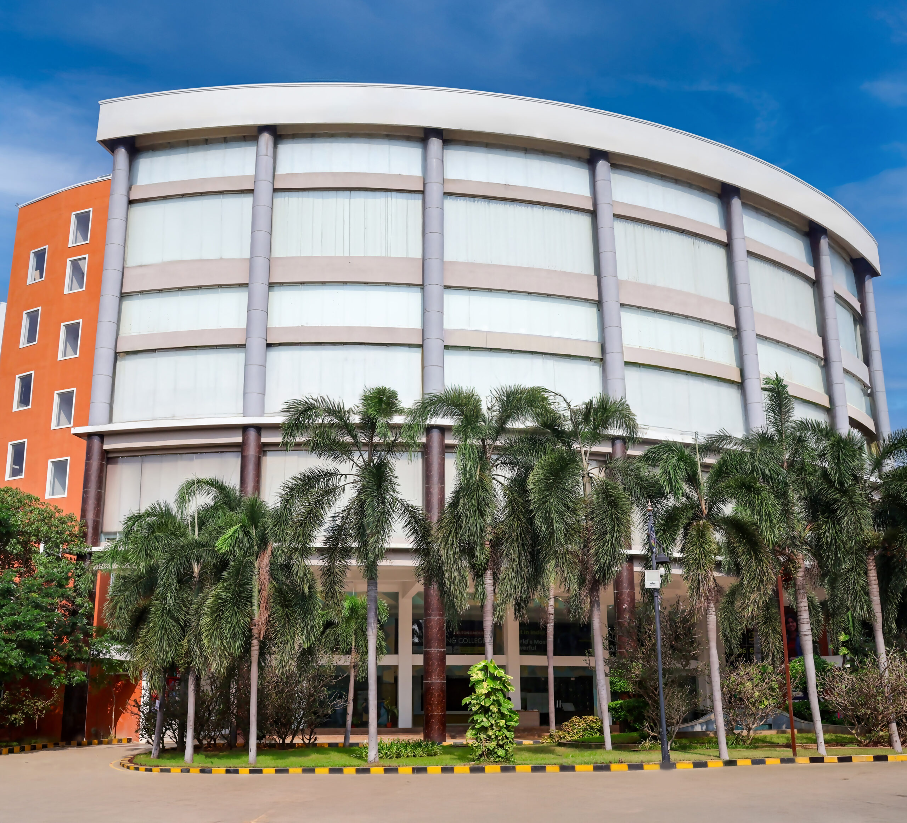

# Ex04 Places Around Me
## Date: 12/12/2025
## AIM
To develop a website to display details about the places around my house.

## DESIGN STEPS

### STEP 1
Create a Django admin interface.

### STEP 2
Download your city map from Google.

### STEP 3
Using ```<map>``` tag name the map.

### STEP 4
Create clickable regions in the image using ```<area>``` tag.

### STEP 5
Write HTML programs for all the regions identified.

### STEP 6
Execute the programs and publish them.

## CODE
```
home.html
<!DOCTYPE html>
<html lang="en">
<head>
    <meta charset="UTF-8">
    <meta name="viewport" content="width=device-width, initial-scale=1.0">
    <title>Document</title>
</head>
<body>
  <!-- Image Map Generated by http://www.image-map.net/ -->


<map name="image-map">
    <area target="" alt="krishna river" title="krishna river" href="river.html" coords="96,361,304,480" shape="rect">
    <area target="" alt="simats" title="simats" href="simats.html" coords="722,468,89" shape="circle">
    <area target="" alt="sec" title="sec" href="sec.html" coords="384,480,437,530,515,497,513,430,429,422" shape="poly">
</map>  
</body>
</html>
river.html
<!DOCTYPE html>
<html lang="en">
<head>
    <meta charset="UTF-8">
    <meta name="viewport" content="width=device-width, initial-scale=1.0">
    <title>Document</title>
</head>
<body>
    
        Krishna River canals are a vital network, especially in its fertile delta (Andhra Pradesh), controlled by structures like the Vijayawada weir, distributing water for extensive irrigation, with prominent examples like the Eluru Canal (though facing issues like encroachment), forming crucial parts of India's National Waterways (NW4) for transport, and serving as essential links for agriculture and industry across Maharashtra, Karnataka, Telangana, and Andhra Pradesh
    </p>
</body>
</html>
sec.html
<!DOCTYPE html>
<html lang="en">
<head>
    <meta charset="UTF-8">
    <meta name="viewport" content="width=device-width, initial-scale=1.0">
    <title>Document</title>
</head>
<body>
    Saveetha Engineering College (SEC), established 2001 in Chennai, is an autonomous institution affiliated with Anna University, known for its strong infrastructure, experienced faculty, and focus on industry-relevant education, holding NAAC 'A' Grade accreditation and recognition as a SIRO by the Indian government, offering UG, PG, and Doctoral programs with good placement records and innovative teaching methods</p>
</body>
</html>
simats.html
<!DOCTYPE html>
<html lang="en">
<head>
    <meta charset="UTF-8">
    <meta name="viewport" content="width=device-width, initial-scale=1.0">
    <title>Document</title>
</head>
<body>
    Saveetha Institute of Medical and Technical Sciences (SIMATS), formerly Saveetha University, is a prestigious UGC-approved Deemed University in Chennai, established in 2005, known for excellence across Medicine, Dentistry, Engineering, Law, Management, and Allied Health Sciences, boasting high rankings (NAAC A++), advanced infrastructure, strong industry links, and a focus on research and holistic student development, including digital learning environments and robust placement support in technical and medical fields</p>
</body>
</html>
```


## OUTPUT





## RESULT
The program for implementing image maps using HTML is executed successfully.
